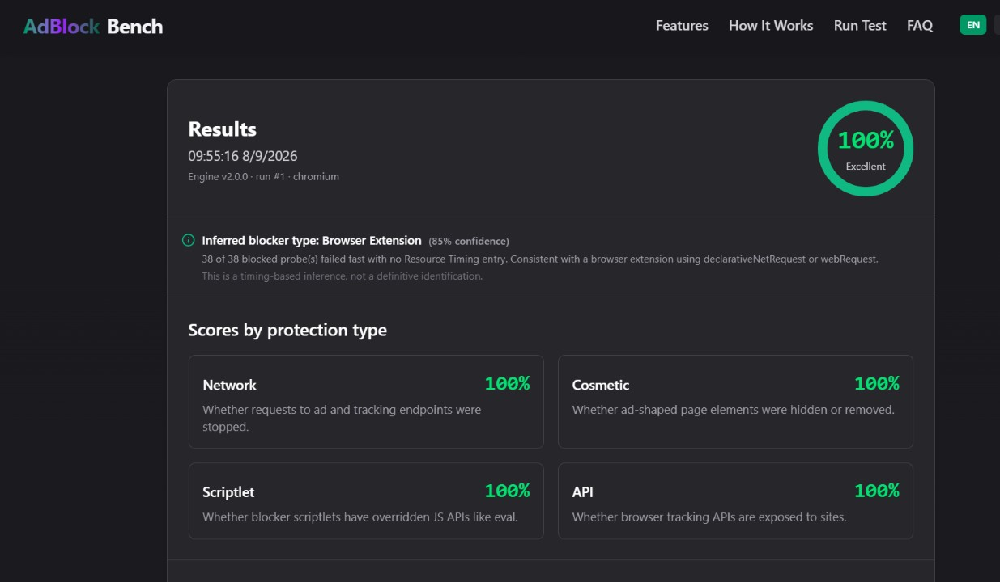
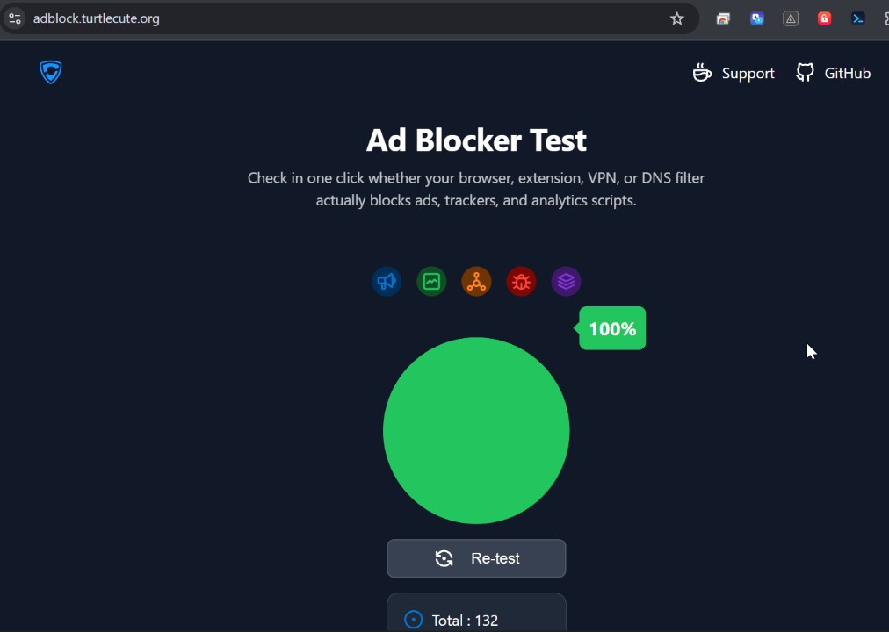
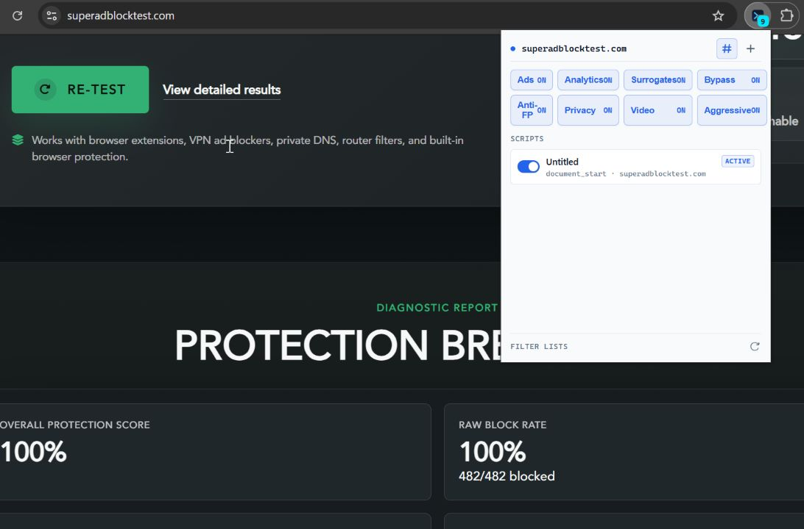

# Script Lean

**Fast. Light. Clean pages.** A lightweight ad blocker + user-script injector for Chromium browsers — blocks ads before they load, makes pages faster, and stays out of your way.

Languages: [English](README.md) · [Tiếng Việt](README.vi.md) · [Español](README.es.md) · [Português](README.pt.md) · [Deutsch](README.de.md) · [Français](README.fr.md)

## Why Script Lean

- **Faster page loads** — ads and trackers are blocked at the network level *before* they download. Nothing heavy runs on the page.
- **Tiny footprint** — the whole extension is ~80 KB. No background bloat, auto-stop cosmetic sweeps, native rule engine.
- **Top scores, verifiable**

  | Test | Result |
  |---|---|
  | AdBlockBench | **100%** — Network · Cosmetic · Scriptlet · API |
  | superadblocktest.com | **100%** — 482/482 blocked |
  | adblock.turtlecute.org | **100%** |

- **Sites keep working** — the safe **Ads** module never touches page function; broader patterns live in a separate, off-by-default **Aggressive** module. Bot checks (Cloudflare/DataDome) and bank/payment pages are passed through untouched.
- **Hard to detect** — patched APIs keep native fingerprints; first-party traffic is never touched, so sites behave normally.
- **8 one-click modules** — Ads · Analytics · Surrogates · Bypass · Anti-Fingerprint · Privacy · Video · Aggressive (off by default).
- **Custom filter lists** — paste any list URL, or write your own rules: `||ads.example.com^` to block, `@@||mysite.com^` to allow. Applied instantly, works offline.
- **Custom JavaScript injection** — inject your own JS per site (domain / URL pattern / regex) with an optional scheduler. A small badge shows how many scripts are active; click the **#** icon in the popup to hide it.
- **Private by design** — everything runs locally. No accounts, no telemetry, no data collection.

## Install (Chrome / Edge / Brave / any Chromium) — 1 minute

1. Download `releases/script-lean-2.5.2.crx`.
2. Open `chrome://extensions`.
3. Drag the `.crx` file onto the page → confirm **Add extension**. Done.
4. Pin the icon → click it → toggle what you need.

> Prefer the source? Download `releases/script-lean-2.5.2.zip` and unzip it (or `git clone` this repo — the source *is* the extension), then turn on **Developer mode** → **Load unpacked** → select the `script-lean-2.5.2` folder. This route always works, even if the browser blocks side-loaded `.crx` files.

Verify your download (MD5):

```
61a00846af9f879462dc39109e09fd94  script-lean-2.5.2.zip
8d5cef567cae9c8e1a2f257c3753a767  script-lean-2.5.2.crx
```

## First run

- Popup shows the current site, 8 module chips, your scripts, and filter lists.
- **Custom JS** needs the browser toggle *Allow User Scripts* (`chrome://extensions` → Script Lean → Details) — the popup shows a one-click banner for it when needed. Ad blocking works without it.
- Blocked-ad leftovers? The **Ads** module already collapses the empty boxes; turn on **Aggressive** only if a site still shows junk.

## Screenshots

| AdBlockBench | TurtleCute | SuperAdBlockTest |
|---|---|---|
|  |  |  |

## Notes

- License: [MIT](LICENSE).

## Reading

**[Where Ads Get Cut](https://duydanh9989.github.io/ad-blocking-intervention-points/)** — How web ad blocking actually works, and the peer economy it pushes the web toward.
